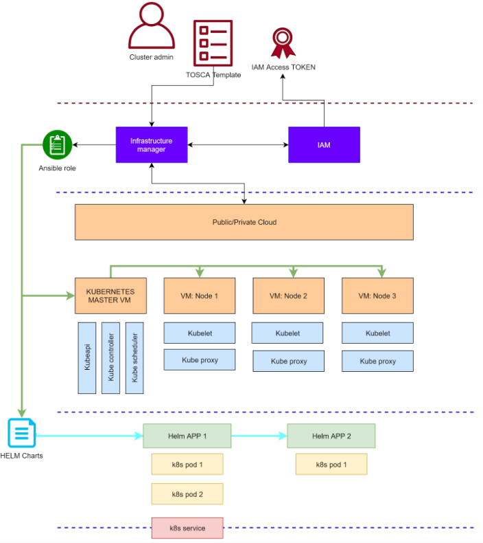
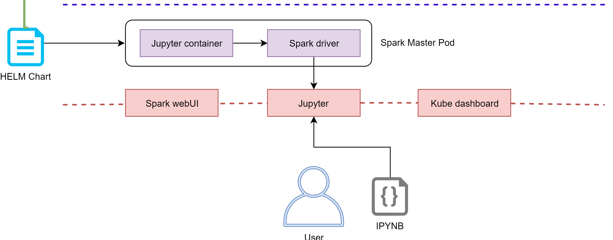
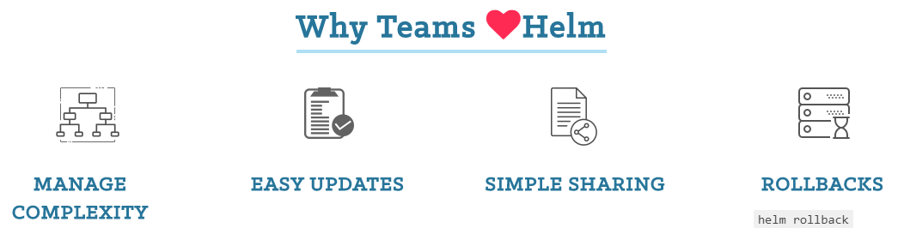

# Hand-on session

# DODAS generated Spark cluster

### Contact: diego.ciangottini<at\>pg.infn.it

Markdown version of this presentation can be found [here](https://github.com/DODAS-TS/HandsOnSparkDODAS2019/blob/master/docs/pres.md)

# Big Data Analytics
## 9-12 Dic. 2019, Bologna

---

# Presentation keyboard shortcut

- Press `h` to toggle display of help
- Press `left arrow` and `right arrow` to navigate
- Press `t` to toggle a table of contents for your presentation. Slide titles are links
- Press `ESC` to display the presentation overview (Exposé)
- Press `n` to toggle slide number visibility
- Press `e` to make slides filling the whole available space within the document body

---

# Overview

- Objective recap
    1. Deploy your own Spark cluster with Dodas
    2. How to template applications with Helm
        - Simple function example
    3. Get to know user interfaces for Spark on Dodas
        - Experimenting base features
        - Debugging

---

# K8s on DODAS

---

# Spark on DODAS

## Client mode with Jupyter notebook

You see here Helm as a tool for templating applications on K8s. We will take a look at this later after we start the deployment (sorry time reason)

At the end we wiil also see an example of job submission in __cluster mode__

---

# Setup architecture: recap

- __1 Master pod__:
    - __Spark driver__
    - __Jupyter__

- __Services__:
    - __Jupyter__
    - __Spark webUI__
    - __K8s dashboard__

- __At notebook python Kernel start__:
    - __2 executor pods__

Directly from the notebook is also possible to stop the current spark context and to reload a new one with different executors.

---

# Question time 1.

---

# Let's start our deployment

## Download the Hands-on repo

    !bash
    git clone https://github.com/DODAS-TS/HandsOnSparkDODAS2019.git
    cd HandsOnSparkDODAS2019

## Copy your DODAS configuration template

    !bash
    cp templates/dodas_template.yaml ~/.dodas_template.yaml

---

# Quick look at DODAS client configuration

    !yaml
    cloud:
        id: ost
        type: OpenStack
        host: https://horizon.cloud.cnaf.infn.it:5000/v3
        username: iam-demo 
        password: token_template 
        tenant: oidc 
        auth_version: 3.x_oidc_access_token
        service_region: regionOne
        auth_url: "https://horizon.cloud.cnaf.infn.it:5000" 
    im:
        id: im
        type: InfrastructureManager
        host: https://im-demo.cloud.cnaf.infn.it/infrastructures
        token: token_template 

---

## Retrieve you access token from IAM

### Import the pre-configured client for the demo
 
    !bash
    export IAM_DEVICE_CODE_CLIENT_ID=7b50c794-c45a-45ad-906f-83cb18e36a5d

    export IAM_DEVICE_CODE_CLIENT_SECRET=AJTXpc_Mo4ZgtcO7cT5CYYFHEQbeaV5IVYTiU4YQFoHyDMYZWiDPqvgmWLSV6ryBfF-HVbzLujPpgemifvVWcTY

### Retrieve the token

Simply run and follow the instructions:

    !bash
    ./scripts/get_token.sh

### Check $HOME/.dodas.yaml file correctly filled

    !bash
    cat ~/.dodas.yaml

---

# Install DODAS client

## Documentation

You can find a quick start guide and reference guide [here](https://cloud-pg.github.io/dodas-go-client/)

## Download the binary

    !bash
    wget https://github.com/Cloud-PG/dodas-go-client/releases/download/v0.3.0/dodas.zip
    unzip dodas.zip

## Test the installation

    !bash
    ./dodas --version

---

# Deploy your cluster

## Get TOSCA template

    !bash
    less templates/spark_template.yml

---

# Question time 2.

---

## Deploy the cluster

### Validation

You can check for an error in your templates with `dodas validate command`

    !bash
    ./dodas validate --template templates/spark_template.yml

### Launch the deployment

    !bash
    $ ./dodas create templates/spark_template.yml 
        Using config file: /home/centos/.dodas.yaml
        validate called
        Template OK
        Template: templates/spark_template.yml 
        Submitting request to  :  https://im-demo.cloud.cnaf.infn.it/infrastructures
        InfrastructureID:  c8a7a544-1bee-11ea-a67e-0242ac160003

### Check the status of the vm configuration

Checking the status of configuration on master node:

    !bash
    $ ./dodas get status vm c8a7a544-1bee-11ea-a67e-0242ac160003 0

---

# Time for Helm... in a nutshell

---

# Helm: introduction exercise

While the deployment goes, let's setup a local playgroud to understand how the K8s templating works with HELM.

1. Knowing the tool
2. How you can develop and test a chart
3. A look at Dodas spark chart 

---

## What's Helm 1/2

[Helm](https://helm.sh/) helps managing Kubernetes applications through a standard templating.
The latest version of Helm is maintained by the CNCF - in collaboration with Microsoft, Google, Bitnami and the Helm contributor community. For this hands on we will use the v2 though, since DODAS is currently in the middle of the migration from v2 to v3. 

---

## What's Helm 2/2

On [HelmHub](https://hub.helm.sh/) you can find by yourselves the motivation of adopting a widely adopted template format.

Helm uses a packaging format called charts. A chart is a collection of files that describe a related set of Kubernetes resources. A single chart might be used to deploy something simple, like a memcached pod, or something complex, like a full web app stack with HTTP servers, databases, caches, and so on.

---
# Install Helm and local k8s

Let's setup our local cluster with 2 fake nodes that will be our __dev environment__:

    !bash
    # Install k8s cli
    curl -LO https://storage.googleapis.com/kubernetes-release/release/`curl -s https://storage.googleapis.com/kubernetes-release/release/stable.txt`/bin/linux/amd64/kubectl
    chmod +x kubectl 

    # Install k8s in docker
    curl -Lo ./kind https://github.com/kubernetes-sigs/kind/releases/download/v0.6.1/kind-$(uname)-amd64
    chmod +x ./kind

    # deploy the playground
    ./kind create cluster --config templates/kind_cluster_config.yml

    # install helm client
    curl https://raw.githubusercontent.com/helm/helm/master/scripts/get-helm-3 | bash

Check that everything is working with:

    !bash
    $ ./kubectl get node
        NAME                 STATUS   ROLES    AGE     VERSION
        kind-control-plane   Ready    master   3m55s   v1.16.3
        kind-worker          Ready    <none>   2m36s   v1.16.3
        kind-worker2         Ready    <none>   2m36s   v1.16.3

---
## Simple example

### Init your chart

    !bash
    # Create a defualt chart
    helm create myfirstchart

    # Remove standard templates
    rm -rf myfirstchart/templates/*

### Chart folder tree

Charts are created as files laid out in a particular directory tree, then they can be packaged into versioned archives to be deployed.

    !text
    myfirstchart/
        Chart.yaml          # A YAML file containing information about the chart
        LICENSE             # OPTIONAL: A plain text file containing the license for the chart
        README.md           # OPTIONAL: A human-readable README file
        values.yaml         # The default configuration values for this chart
        templates/          # A directory of templates that, when combined with values,
                            # will generate valid Kubernetes manifest files.
        templates/NOTES.txt # OPTIONAL: A plain text file containing short usage notes

---

# Helm: "chart up" your application

## Deployment template

    !yaml
    apiVersion: apps/v1
    kind: Deployment
    metadata:
        name: lookup-deployment
    spec:
        replicas: 1
        template:
            metadata:
                labels:
                    app: {{ .Values.appName }}
            spec:
                containers:
                - name: lookup-container-deployment
                  image: dciangot/lookup 
                  ports:
                  - containerPort: 80
                  env:
                  - name: SIMPLE_SERVICE_VERSION
                  value: "1.0"
                  resources:
                    limits:
                        memory: "64Mi"
                        cpu: "500m"
                - name: probe-container
                  image: dciangot/probe

        selector:
            matchLabels:
                app: {{ .Values.appName }}

---
## Service template

    !yaml
    apiVersion: v1
    kind: Service
    metadata:
        name: simpleservice
    spec:
        ports:
            - port: {{ .Values.servicePort }}
              targetPort: 80
        selector:
            app: {{ .Values.appName }}

## Value file

In `values.yaml` we can now put our deployment variables:

    !yaml
    servicePort: 30080
    appName: myApp

---

## Install your Helm chart on the cluster

    !bash
    $ helm install mychart ./myfirstchart
        NAME: mychart
        LAST DEPLOYED: Wed Dec 11 09:02:50 2019
        NAMESPACE: default
        STATUS: deployed
        REVISION: 1
        TEST SUITE: None

One can also verified the manifest that has been actually submitted to k8s with:

    !bash
    helm get manifest mychart

You should see that the parameters in the templates should be filled with the values we passed on values.yaml file.

---

## Verify the deployments

    !bash
    $ ./kubectl get pod
        NAME                                 READY   STATUS    RESTARTS   AGE
        lookup-deployment-64dd5568bc-6dft5   2/2     Running   0          49s

## Publish the chart

Charts can then be exposed for external reuse creating repositories with various methods described [here](https://helm.sh/docs/howto/chart_repository_sync_example/)

---

# Question time 3.

---

# Spark HELM chart

## A look at need values 

    !yaml
    Spark:
        Path: /opt/spark

    externalIP:
        enabled: true
        ip: {{ externalIP }}

    Master:
        Name: master
        Image: cloudpg/spark-py
        ImageTag: dodas-2.4.3-bigdl
        Replicas: 1
        Component: spark-master
        Cpu: 100m
        Memory: 1024Mi
        ServicePort: 7077
        ContainerPort: 7077
        # Set Master JVM memory. Default 1g
        # DaemonMemory: 1g
        ServiceType: ClusterIP
    Jupyter:
        NodePort: 30888

---

# More details

Find the whole chart tree in `templates/helm/spark`
And the spark image for Kubernetes resource manager [here](https://github.com/apache/spark/tree/master/resource-managers/kubernetes)

---

# Question time 4.

---
# Time to play with DODAS Spark cluster

### Retrieve again the token

### Check the status of the deployment

By now you should see something like:

    !bash
    $ ./dodas get status vm c8a7a544-1bee-11ea-a67e-0242ac160003 0
        ...
        ...
        TASK [cloud-pg.ansible_role_helm : Helm install chart cloudpg/spark] ***********
        Wednesday 11 December 2019  08:35:44.102069 
        changed: [131.154.96.135_0]

        PLAY RECAP *********************************************************************
        131.154.96.135_0           : ok=4    changed=4    unreachable=0    failed=0   
        131.154.96.135_0           : ok=4    changed=4    unreachable=0    failed=0   

        Task helm_spark_conf_k8s_master_server finished successfully
        Process finished

If not, don't worry, we got a backup solution at `131.154.96.222:30888`

---

## Kubernetes Web-UI

The UI should be now exposed on the port 30443 of you master node e.g. `https://<your master IP>:30443`

## Spark Web-UI

The UI should be now exposed on the port 30443 of you master node e.g. `https://<your master IP>:30808`

## Log into the k8s master

You are also able to log into the master retrieving access information with the dodas client:

    !bash
    ./dodas get vm c8a7a544-1bee-11ea-a67e-0242ac160003 0

Just save the prompted private key and login with `cloudadm` user

---

# Question time 5.

--- 

# Using Jupyter

Jupyter is accessible at `http://<your master IP>:30888` with the password `testme`

## Load the exercise notebook

You should be able now to import the exercise notebook in `templates/spark_notebook.ipynb` with the upload button and to start its kernel.

### Check the executor pods appearing 

In the k8s web ui you should see now 2 additional pods appearing as the spark shell have been started by the kernel automatically creating  a pool of executor.

The number and size of executors can be tuned both at TOSCA level and directly from Jupyter as you can find the in the example playbook provided.

---

# Question time 6 and the last one :) 

[How do I learn K8s and all these other stuff?](https://twitter.com/danielepolencic/status/1158737805557686277?s=19)

---

# Destroy the cluster

Just retrieve the token again and then do:

    !bash
    ./dodas destroy  c8a7a544-1bee-11ea-a67e-0242ac160003 

---

# Finally, what about lego composition?

Let's take a look at how you can leverage the DODAS stack and compose different application.

In `templates/spark_minio_template.yaml` you can find an example where the setup you just made with an S3 object storage using MINIO.

The chart relative to Minio installation is [here](https://github.com/helm/charts/tree/master/stable/minio)