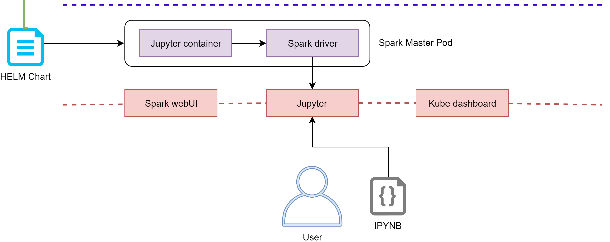

# Hand-on session

## DODAS generated Spark cluster

### Contact: diego.ciangottini\<at\>pg.infn.it

---

# Overview

- Objective recap
    - Deploy your own cluster
- Templating applications with Helm
    - Simple function example
- User interfaces for Spark on Dodas
    - Experimenting base features
    - Debugging

---

# K8s on DODAS

---

# Spark on DODAS

---

# Setup architecture: recap

- __1 Master pod__:
    - __Spark driver__
    - __Jupyter__

- __Services__:
    - __Jupyter__
    - __Spark webUI__
    - __K8s dashboard__

- __At notebook python Kernel start__:
    - __2 executor pods__

Also possible to step them and reload a spark context with different executors from the notebook directly.

---

# Setting up you environment

## Download the Hands-on repo

    !bash
    wget https://github.com/DODAS-TS/HandsOnSparkDODAS2019.git
    cd HandsOnSparkDODAS2019

## Copy your DODAS configuration template

    !bash
    cp templates/....

## Retrieve you access token from IAM

...

---

# Install DODAS client

## Documentation

## Download the binary

## Configuration

## Test the installation
---

# Deploy your cluster

## Get TOSCA template

## Fill the configuration parameters

## Deploy the cluster

## Check the status

---

# Helm: introduction exercise

## What's Helm

## Install Helm

## Simple example

### Init your chart

---

# Helm: "chart up" your application

## Application 1

## Application 2

## Test your Helm chart

## Publish the chart

Reference [documentation]()

---

# Time to play with Spark cluster

## Debugging

### Kubernetes Web-UI

### Spark Web-UI

### Log into the k8s master

--- 

# Using Jupyter

## Load the exercise notebook

### Check the executor pods appearing 

## Basic functional test

### Calculate Pi

    !python
    def test:

---

# Spark playground

---
